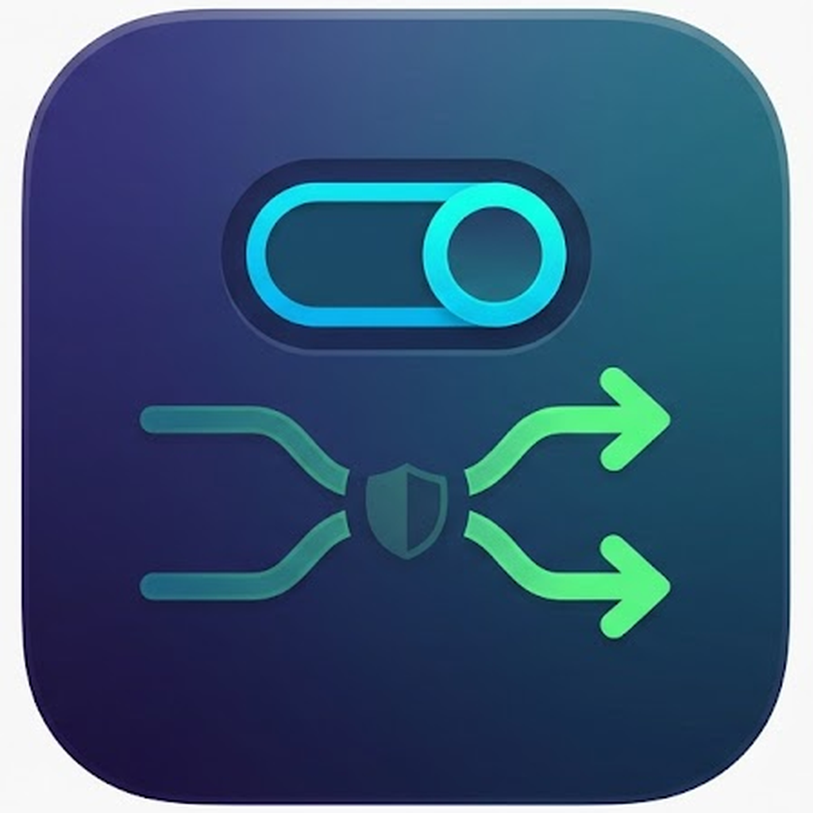

<p align="center">
  
</p>

<h1 align="center">ProxySwitcher-ng</h1>

<p align="center">
  Flip your iPhone's Wi-Fi proxy on and off from Settings, and keep a list of
  proxies you can switch between with one tap.
</p>

---

Made for the times you want your phone's traffic going through Burp, mitmproxy,
or any other intercepting proxy, without digging through the stock Wi-Fi settings
every time. Set your proxies once, then flip between them.

## What it does

- **One switch.** Turn the Wi-Fi HTTP/HTTPS proxy on or off from a single toggle.
- **Saved profiles.** Keep a list of proxies (`host:port`) and tap to make one
  active. Add, edit, and delete them right in Settings, no SSH needed.
- **Sticks around.** A small root daemon re-applies your proxy when you switch
  Wi-Fi networks, so it does not fall off on you.
- **Apply and check.** An Apply button re-pushes the setting and tells you whether
  the phone can still reach the internet through it.
- **Logs when you want them.** Turn on logging to see exactly what the daemon did,
  readable from a Logs page inside the app.

## Install

Add the repo to Sileo, then search for **ProxySwitcher-ng**:

```
https://ymuu.me/repo
```

Or open this link on your device:

<https://ymuu.me/repo>

Works on rootless and roothide jailbreaks (Dopamine and similar), iOS 15 and up.
After installing, respring when Sileo offers.

## How it works

```
Settings (ProxySwitcher-ng panel)
   writes prefs, posts a Darwin notification
        v
proxyswitcherngd (root daemon)
   reads the active proxy, writes the Wi-Fi service's proxy keys
        v
SystemConfiguration commit + apply
```

The Settings panel is a compiled arm64e preference bundle. The daemon is a
standalone arm64 launch daemon. They talk over a shared prefs domain
(`io.ymuu.proxyswitcherng`) and Darwin notifications.

## Building

The arm64e preference bundle is built on a macOS GitHub Actions runner, since a
correct arm64e ABI needs Apple's toolchain. Push a branch and the workflow builds
and uploads the `.deb`. See `docs/CI-ARM64E-BUILD.md` for the details and the
potholes.

## Credit

A modern rewrite of [mikaelbo/ProxySwitcher](https://github.com/mikaelbo/ProxySwitcher),
the original iOS 9 tweak. Same idea, rebuilt for modern rootless and roothide
jailbreaks, with saved profiles and a few extras.

## License

See the upstream project for its license. This rewrite is shared for research and
personal use.
