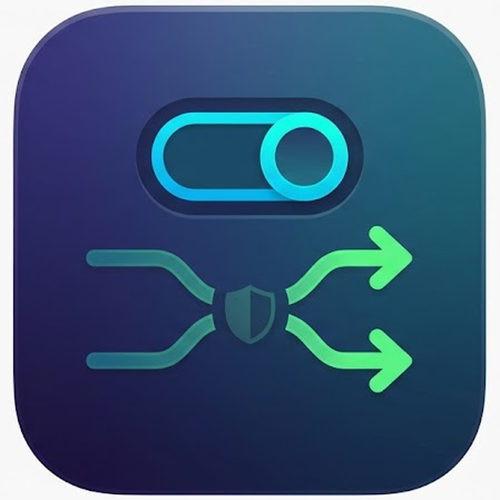

<p align="center">
  
</p>

<h1 align="center">ProxySwitcher-ng</h1>

<p align="center">
  Flip your iPhone's Wi-Fi proxy on and off from Settings, and keep a list of
  proxies you can switch between with one tap.
</p>

<p align="center">
  
</p>

---

Made for the times you want your phone's traffic going through Burp, mitmproxy,
or any other intercepting proxy, without digging through the stock Wi-Fi settings
every time. Set your proxies once, then flip between them.

## What it does

- **One switch.** Turn the Wi-Fi HTTP/HTTPS proxy on or off from a single toggle.
- **HTTP or SOCKS.** Each proxy can be HTTP/HTTPS or SOCKS5, chosen per profile
  with a simple switch. Point your phone at a SOCKS tunnel (`ssh -D`, mitmproxy
  `--mode socks5`, and the like) or a regular HTTP intercept proxy.
- **Saved profiles.** Keep a list of proxies (`host:port`) and tap to make one
  active. Add, edit, and delete them right in Settings, no SSH needed. Edit an
  existing profile to flip it between HTTP and SOCKS without recreating it. Each
  row shows the name and address on top, with the protocol and whether auth is on
  in smaller text underneath.
- **Tunnel mode, for apps that ignore the proxy (beta).** Some apps never read the
  Wi-Fi proxy setting, so their traffic never reaches your intercept proxy no matter
  what you set. Flutter apps are the usual culprit. Tunnel mode takes over the phone's
  routing instead of asking politely, so everything goes through your proxy whether
  the app cooperates or not. Off by default, and Apple's own services are routed
  around it so push notifications keep working.
- **Sticks around.** A small root daemon re-applies your proxy when you switch
  Wi-Fi networks, so it does not fall off on you.
- **Apply and check, for real.** The Apply button actually routes a request
  through the proxy to a test host and reports back. It speaks the proxy's own
  protocol (HTTP `CONNECT`, or the SOCKS5 handshake), so it cannot be fooled by
  iOS silently falling back to a direct connection, and a failure shows the
  specific reason (connection refused, timeout, SOCKS reply code, HTTP status).
- **Logs when you want them.** Turn on logging to see exactly what the daemon did,
  readable from a Logs page inside the app.
- **Authenticated proxies.** A profile (or the manual entry) can carry a username
  and password. Flip on **Use authentication** and the fields appear. Because iOS
  ignores system-proxy credentials, the tweak runs a small loopback relay inside the
  root daemon that performs the authenticated upstream handshake itself. Credentials
  live in the daemon's keychain, never in cfprefs or logs. See
  [Authentication](#authentication) for how it works.

## Install

Add the repo to Sileo, then search for **ProxySwitcher-ng**:

```
https://ymuu.me/repo
```

Or open this link on your device:

<https://ymuu.me/repo>

Works on rootless and roothide jailbreaks (Dopamine and similar), iOS 15 and up.
After installing, respring when Sileo offers.

## How it works

```
Settings (ProxySwitcher-ng panel)
   writes prefs, posts a Darwin notification
        v
proxyswitcherngd (root daemon)
   reads the active proxy, writes the Wi-Fi service's proxy keys
        v
SystemConfiguration commit + apply
```

The Settings panel is a compiled arm64e preference bundle. The daemon is a
standalone arm64 launch daemon. They talk over a shared prefs domain
(`io.ymuu.proxyswitcherng`) and Darwin notifications.

## Authentication

Some proxies want a username and password. iOS makes this awkward: if you put
credentials into the system proxy settings, it **ignores them**. An HTTP proxy
just pops the 407 auth dialog it cannot answer inside a `CONNECT` tunnel, and the
built-in SOCKS client only ever offers "no authentication," never the user/pass
method. So the credentials you type would go nowhere.

The tweak gets around this the same way apps like Potatso and Shadowrocket do, by
running its own proxy on the device and letting *that* speak the authenticated
handshake, only lighter, with no VPN. When a profile has credentials, the daemon
starts a tiny **loopback relay** and points the system Wi-Fi proxy at it:

```
app traffic
   v
127.0.0.1:8899   (relay inside proxyswitcherngd, listens on loopback only)
   adds the auth the real proxy wants:
     HTTP  CONNECT  ->  Proxy-Authorization: Basic <base64 user:pass>
     SOCKS5          ->  RFC 1929 username/password sub-negotiation
   v
your real upstream proxy (host:port)
   v
the internet
```

To the system it looks like an ordinary, no-auth proxy at `127.0.0.1:8899`; the
relay is the one that authenticates upstream, then just pumps bytes both ways. A
profile with **no** credentials skips the relay entirely and points straight at the
proxy, exactly as before.

Where the password lives matters:

- It is stored in the **daemon's keychain** (`kSecClassInternetPassword`,
  accessible `AfterFirstUnlockThisDeviceOnly`); never written to the prefs plist,
  never printed to a log line.
- The Settings panel hands new credentials to the daemon over a local UNIX socket,
  in memory; nothing sensitive is left on disk by the UI.
- Turn the **Use authentication** switch off (on either the manual screen or a
  profile) and the stored credential for that `host:port` is deleted.

Notes and limits: HTTPS through `CONNECT` is fully covered. Plain-HTTP keep-alive
is best-effort. The relay listens on `127.0.0.1` only, so it is not reachable from
the network.

## Building

The arm64e preference bundle is built on a macOS GitHub Actions runner, since a
correct arm64e ABI needs Apple's toolchain. Push a branch and the workflow builds
and uploads the `.deb`. See `docs/CI-ARM64E-BUILD.md` for the details and the
potholes.

> Note: I am no developer by any means, but I build tools to help me with my workflow, so why not share? :'D

## Changelog

### Unreleased

- **Tunnel mode — catch apps that ignore the proxy (beta).** Some apps never look at
  the Wi-Fi proxy setting at all. Flutter apps are the usual example: the proxy is
  only a suggestion, and their networking code just doesn't read it, so their traffic
  goes straight out and never reaches Burp. Tunnel mode fixes that by taking over the
  phone's routing instead of asking nicely, so **everything** goes through your proxy
  whether the app cooperates or not.

  It's a switch in Settings, off by default. Turn it on when an app is dodging you,
  turn it off when you're done and everything goes back to normal.

  Worth knowing before you use it:

  - It really does mean *all* traffic, so expect a much noisier Burp.
  - QUIC/HTTP-3 gets refused on purpose, which makes apps fall back to normal TCP so
    you can actually see the traffic.
  - It needs an HTTP proxy upstream. With SOCKS selected it will refuse and stay in
    normal mode rather than half-work.
  - This one is **beta.** It's been tested on real Flutter apps and works, but it's a
    big hammer and I'd like feedback before calling it done.

- **Exclude Apple services (on by default).** Because tunnel mode grabs everything, it
  was also grabbing Apple's own connections — and those refuse to go through a proxy,
  which quietly broke push notifications, location services, and universal links while
  the tunnel was on. Apple's traffic now goes around the tunnel, so your phone keeps
  behaving like a phone. Turn it off if you specifically want to look at Apple traffic.

  Known gap: this only covers IPv4 right now. On a network with working IPv6, some
  Apple traffic can still get pulled into the tunnel and those services may still
  misbehave. If you hit that, turning tunnel mode off puts everything back.

- **Fix: the Wi-Fi icon vanished from the status bar** while tunnel mode was on, with
  nothing in its place, so there was no way to tell if you were even connected. The
  tunnel now tells iOS which real interface it's sitting on top of, and the icon stays
  put.

- **Fix:** Settings crashed on open (SIGABRT) as soon as the Profiles list drew,
  because the custom profile-row cell class was handed to the specifier as a class
  *name string* instead of the `Class` object. Now passes the class itself.
- **Auth toggle + tidier profile rows.** A "Use authentication" switch on both the
  manual-entry and edit-profile screens shows the username/password fields only when
  you want them. Each profile row is now two lines: name and address on top, protocol
  and auth status (`HTTP · Auth enabled` / `SOCKS · No auth`) in smaller text below.
- **Authenticated proxy support.** Profiles can carry a username and password; an
  in-daemon loopback relay authenticates upstream with HTTP Basic or SOCKS5
  user/pass, and credentials live in the keychain.
- **SOCKS5 support.** Each profile can now be HTTP/HTTPS or SOCKS5, chosen with a
  per-profile switch, plus a switch for the manual entry. The daemon writes the
  Wi-Fi service's SOCKS keys or HTTP/HTTPS keys accordingly and never leaves both
  set at once.
- **Real end-to-end Apply check.** Apply now reaches a test host through the proxy
  using the proxy's own protocol (HTTP `CONNECT` / SOCKS5), instead of only
  checking that the proxy port is open. Failures report the specific reason.
- **Universal build.** The preference bundle now ships both arm64 and arm64e
  slices, so it loads on A11 and older devices (iPhone 8 / X) as well as A12+.


## Credit

A modern rewrite of [mikaelbo/ProxySwitcher](https://github.com/mikaelbo/ProxySwitcher),
the original iOS 9 tweak. Same idea, rebuilt for modern rootless and roothide
jailbreaks, with saved profiles and a few extras.

## References

**Bundled in the daemon** (tunnel mode's packet engine, licenses kept in `vendor/`)

- [hev-socks5-tunnel](https://github.com/heiher/hev-socks5-tunnel) by heiher, MIT: tun2socks engine
- [lwIP](https://savannah.nongnu.org/projects/lwip/), BSD 3-clause: the TCP/IP stack under it
- [libyaml](https://github.com/yaml/libyaml), MIT: parses the engine config
- [hev-task-system](https://github.com/heiher/hev-task-system) by heiher, MIT: coroutine scheduler

**Prior art**

- [mikaelbo/ProxySwitcher](https://github.com/mikaelbo/ProxySwitcher): the original iOS 9 tweak
- [dannliu/iOSProxyManager](https://github.com/dannliu/iOSProxyManager): another take on the same idea
- [Potatso](https://github.com/jackrex/Potatso-iOS): the design precedent for tunnel mode. Same three layers (tun device, then tun2socks, then SOCKS5 out), and its `tun2socks` + lwIP was the engine measured against the one chosen here. Only the first layer differs: Potatso asks iOS for the tun via NetworkExtension, this creates its own utun as root
- Shadowrocket: same trick, closed source, and the other reason the on-device relay approach was known to work

**Built with**

- [theos](https://theos.dev/): build system
- [roothide/Dopamine](https://github.com/roothide/Dopamine2-roothide): the jailbreak this targets
- [Apple's XNU source](https://github.com/apple-oss-distributions/xnu): kernel headers the iOS SDK leaves out
- [Frida](https://frida.re/): on-device debugging

**Useful alongside it**

- [NVISOsecurity/disable-flutter-tls-verification](https://github.com/NVISOsecurity/disable-flutter-tls-verification): Flutter ignores the iOS trust store, so you need this to read the traffic tunnel mode captures

## License

This rewrite is shared for research and personal use. See the upstream project for its
license.

Tunnel mode bundles third-party code under `vendor/`, MIT except lwIP which is BSD
3-clause. Each keeps its own license file in place.
